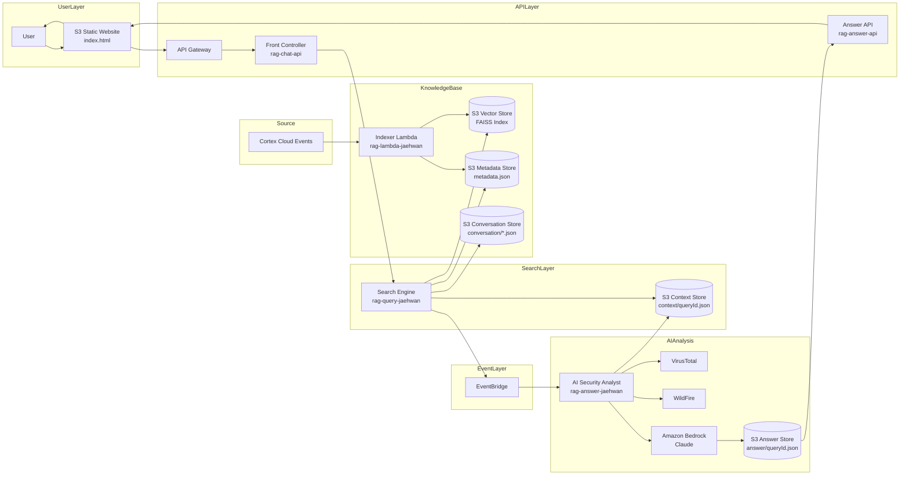

# AI 분석 에이전트 개발 가이드(Cortex)

Amazon Bedrock, AWS Lambda, S3를 활용하여 보안 이벤트 분석용 AI 에이전트를 구현하였습니다.<br>
일반적인 AI 챗봇은 사용자의 질문을 사전 학습된 지식을 기반으로 답변을 생성하지만, Cortex Cloud 실제 보안 이벤트를 기반으로 답변을 생성합니다.<br>
RAG(Retrieval-Augmented Generation)를 적용하여 사용자의 질문과 관련된 보안 이벤트를 검색하고, 검색 결과를 AI가 분석 및 권고사항을 제공합니다.<br>

---
## 아키텍처 구조

## 아키텍처 리소스별 역할
1. Indexer Lambda(rag-lambda-jaehwan) 
Cloud Cloud 이벤트를 RAG 검색에 사용할 수 있도록 전처리하는 역할
```bash
> Cortex Cloud 이벤트 수집
> 이벤트 Chunk 분할
> Titan Embedding 수행
> Vector, Metadata, FAISS 인덱스 생성
> Vector Store(S3) 저장
```

2. Front Controller/Proxy(rag-chat-api)
사용자 질의를 수신하여 검색 엔진으로 전달하는 역할
```bash
> API Gateway 요청 수신
> 검색 엔진 호출(rag-query-jaehwan)
> 검색 결과 반환
> 향후 사용자 인증, 접근 제어 및 대화 이력 관리 기능 제공 예정
```

3. Search Engin(rag-query-jaehwan)
사용자 질의에 적합한 Cortex Cloud 데이터를 검색하는 역할
```bash
> 사용자 질의 분석
> 질의 유형 분류
> FAISS 기반 유사도 검색 수행
> 관련 Cortex Cloud 이벤트 검색<br><br>
```

4. Answer API(rag-answer-api)
사용자에게 최종 분석 결과를 제공하는 역할
```bash
> 분석 결과 조회
> 사용자 요청에 대한 응답 반환
> Web UI 응답 처리
```

5. AI Security Analyst(rag-answer-jaehwan)
검색된 Context를 기반으로 AI 보안 분석을 수행하는 역할
```bash
> Context 조회
> 프롬프트 생성
> Cortex Cloud CSPM/CWP/CVE 이벤트 분석
> VirusTotal/WildFire 추가 분석
> 저장 데이터 기준으로 Amazon Bedroc(Claude) 기반 최종 분석 결과 생성
```

6. S3(index.html)
정적 웹호스팅 기반 사용자 인터페이스
```bash
> 사용자 질의 입력
> 분석 결과 조회
> 분석 결과 출력
```
## 출력 형식
```mermaid

```

## 참고용. 코드 설명
1. Indexer Lambda
> Amazon SageMaker, S3에 대한 권한 필요<br>
> S3는 특정 객체에 이벤트가 쌓일 경우 트리거 필요 ex)CSPM_RAG/raw/<br>
> 아래는 전체 코드 정보입니다.
```bash
import json
import uuid
import boto3

s3 = boto3.client("s3")
sm = boto3.client("sagemaker")

RAG_BUCKET = "rag-bucket-jaehwan"

ROLE_ARN = (
    "arn:aws:iam::747935822721:role/service-role/AmazonSageMakerServiceCatalogProductsUseRole"
)
   
def build_embedding_text(chunk):

    event_type = chunk.get(
        "event_type",
        "UNKNOWN"
    )

    # ==================================================
    # Vulnerability (CVE)
    # ==================================================

    if event_type == "VULNERABILITY":

        return f"""
Event Type:
VULNERABILITY

CVE:
{chunk.get('cve_id', '')}

Title:
{chunk.get('alert_name', '')}

Description:
{chunk.get('description', '')}

Severity:
{chunk.get('severity', '')}

CVSS:
{chunk.get('cvss_score', '')}

Package:
{chunk.get('package_purl', '')}

Package Version:
{chunk.get('package_version', '')}

File Path:
{chunk.get('file_path', '')}

Has Fix:
{chunk.get('has_fix', '')}

Fix Versions:
{chunk.get('fix_versions', '')}

Asset:
{chunk.get('asset_name', '')}

Region:
{chunk.get('asset_region', '')}

Account:
{chunk.get('asset_account', '')}

Status:
{chunk.get('status', '')}
""".strip()

    # ==================================================
    # Posture (CSPM)
    # ==================================================

    if event_type == "POSTURE":

        return f"""
Event Type:
POSTURE

Owner:
{chunk.get('issue_owner', '')}

Control:
{chunk.get('alert_name', '')}

Description:
{chunk.get('description', '')}

Severity:
{chunk.get('severity', '')}

Asset:
{chunk.get('asset_name', '')}

Region:
{chunk.get('asset_region', '')}

Account:
{chunk.get('asset_account', '')}

Status:
{chunk.get('status', '')}
""".strip()

    # ==================================================
    # Compute (Runtime / Malware)
    # ==================================================

    if event_type == "COMPUTE":

        return f"""
Event Type:
COMPUTE

Title:
{chunk.get('alert_name', '')}

Description:
{chunk.get('description', '')}

Severity:
{chunk.get('severity', '')}

Malware File:
{chunk.get('malware_file', '')}

File Path:
{chunk.get('file_path', '')}

SHA256:
{chunk.get('file_sha256', '')}

Group:
{chunk.get('group_name', '')}

Owner:
{chunk.get('owner_name', '')}

Last Modified:
{chunk.get('last_modified', '')}

VirusTotal:
{chunk.get('virus_total_link', '')}

Asset:
{chunk.get('asset_name', '')}

Region:
{chunk.get('asset_region', '')}

Account:
{chunk.get('asset_account', '')}

Status:
{chunk.get('status', '')}
""".strip()

    # ==================================================
    # Correlation (XSIAM Correlation Rule)
    # ==================================================

    if event_type == "CORRELATION":

        return f"""
Event Type:
CORRELATION

Title:
{chunk.get('alert_name', '')}

Description:
{chunk.get('description', '')}

Severity:
{chunk.get('severity', '')}

Category:
{chunk.get('alert_category', '')}

Source:
{chunk.get('alert_source', '')}

XQL Query:
{chunk.get('xql_query', '')}

Asset:
{chunk.get('asset_name', '')}

Region:
{chunk.get('asset_region', '')}

Account:
{chunk.get('asset_account', '')}

Status:
{chunk.get('status', '')}
""".strip()

    # ==================================================
    # Fallback
    # ==================================================

    return f"""
Event Type:
{event_type}

Title:
{chunk.get('alert_name', '')}

Description:
{chunk.get('description', '')}

Severity:
{chunk.get('severity', '')}

Asset:
{chunk.get('asset_name', '')}

Account:
{chunk.get('asset_account', '')}
""".strip()

def validate_chunk(chunk):

    required_fields = [

        "event_type",
        "alert_name",
        "description",
        "severity",
        "asset_name"

    ]

    for field in required_fields:

        value = chunk.get(field)

        if value is None:
            return False

        if isinstance(value, str):

            if not value.strip():
                return False

    return True

def lambda_handler(event, context):

    bucket = (
        event["Records"][0]
        ["s3"]["bucket"]["name"]
    )

    key = (
        event["Records"][0]
        ["s3"]["object"]["key"]
    )

    print(f"Bucket : {bucket}")
    print(f"Key : {key}")

    response = s3.get_object(
        Bucket=bucket,
        Key=key
    )

    content = (
        response["Body"]
        .read()
        .decode("utf-8")
    )

    source_data = json.loads(content)

    if isinstance(source_data, dict):
        source_data = [source_data]

    chunk_list = []

    for item in source_data:

        body = item.get("body", item)

        try:

            original_alert = body.get(
                "original_alert_json",
                {}
            )

            nested_alert = original_alert.get(
                "original_alert_json",
                {}
            )

            issues = nested_alert.get(
                "issues",
                []
            )

            alert_source = (
                body.get("alert_source")
                or
                original_alert.get("alert_source")
            )

            if issues:

                issue = issues[0]

                normalized = issue.get(
                    "xdm.issue.normalized_fields",
                    {}
                )

            else:

                if alert_source != "CORRELATION":

                    print(
                        f"NO ISSUES : "
                        f"{body.get('alert_name')}"
                    )

                    continue

                issue = {}

                normalized = {}

            # ==================================================
            # Malware Fields
            # ==================================================

            malware_file = normalized.get(
                "xdm.file.filename"
            )

            file_sha256 = normalized.get(
                "xdm.file.sha256"
            )

            group_name = normalized.get(
                "xdm.file.group_name"
            )

            owner_name = normalized.get(
                "xdm.file.owner_name"
            )

            last_modified = normalized.get(
                "xdm.file.last_modified"
            )

            virus_total_link = normalized.get(
                "xdm.malware.virus_total_link"
            )

            alert_category = original_alert.get(
                "alert_category"
            )

            xql_query = original_alert.get(
                "xql_query"
            )

            asset = {}

            assets = body.get(
                "assets",
                []
            )

            # 일반 Alert
            if assets:

                asset = assets[0]

            # Correlation Alert
            else:

                correlation_events = (
                    original_alert.get(
                        "_all_events",
                        []
                    )
                )

                if correlation_events:

                    first_event = (
                        correlation_events[0]
                    )

                    asset = {

                        "asset_name":
                            first_event.get(
                                "xdm.asset.name"
                            ),

                        "asset_region":
                            first_event.get(
                                "xdm.asset.cloud.region"
                            ),

                        "asset_account":
                            first_event.get(
                                "xdm.asset.realm"
                            ),

                        "asset_provider":
                            first_event.get(
                                "xdm.asset.provider"
                            ),

                        "asset_first_observed":
                            first_event.get(
                                "xdm.asset.first_observed"
                            ),

                        "asset_last_observed":
                            first_event.get(
                                "xdm.asset.last_observed"
                            )
                    }

            # ==================================================
            # Event Classification
            #
            # VULNERABILITY : 취약점(CVE)
            # POSTURE       : CSPM
            # COMPUTE       : Runtime / Malware
            # CORRELATION   : XSIAM Correlation Rule
            # ==================================================

            issue_owner = issue.get(
                "xdm.issue.owner"
            )

            cve_id = normalized.get(
                "xdm.vulnerability.cve_id"
            )

            alert_source = (
                body.get("alert_source")
                or
                original_alert.get("alert_source")
            )

            if alert_source == "VULNERABILITY":

                event_type = "VULNERABILITY"

            elif alert_source == "POSTURE":

                event_type = "POSTURE"

            elif alert_source in [
                "COMPUTE",
                "COMPUTE_POLICY"
            ]:

                event_type = "COMPUTE"

            elif alert_source == "CORRELATION":

                event_type = "CORRELATION"

            else:

                event_type = "UNKNOWN"

            chunk = {

                "chunk_id":
                    str(uuid.uuid4()),

                "event_type":
                    event_type,

                "issue_owner":
                    issue_owner,

                "cve_id":
                    cve_id,

                "alert_name":
                    body.get(
                        "alert_name"
                    ),

                "description":
                (
                    issue.get(
                        "xdm.issue.description"
                    )
                    if issue
                    else
                    original_alert.get(
                        "alert_description"
                    )
                ),

                "severity":
                (
                    issue.get(
                        "xdm.issue.platform_severity"
                    )
                    if issue
                    else
                    original_alert.get(
                        "severity"
                    )
                ),
                
                "cvss_score":
                    normalized.get(
                        "xdm.vulnerability.cvss_score"
                    ),

                "package_purl":
                    normalized.get(
                        "xdm.software_package.purl"
                    ),

                "package_version":
                    normalized.get(
                        "xdm.software_package.version"
                    ),

                "file_path":
                    normalized.get(
                        "xdm.file.path"
                    ),

                "has_fix":
                    normalized.get(
                        "xdm.vulnerability.has_a_fix"
                    ),

                "fix_versions":
                    normalized.get(
                        "xdm.vulnerability.fix_versions"
                    ),

                "remediation":
                    issue.get(
                        "xdm.issue.remediation"
                    ),

                "observation_time":
                (
                    issue.get(
                        "xdm.issue.observation_time"
                    )
                    if issue
                    else
                    original_alert.get(
                        "activity_first_seen_at"
                    )
                ),

                "status":
                (
                    (
                        body.get(
                            "extra_issue_data"
                        )
                        or {}
                    ).get(
                        "platform_status.progress"
                    )
                ),

                "asset_name":
                    asset.get(
                        "asset_name"
                    ),

                "asset_region":
                    asset.get(
                        "asset_region"
                    ),

                "asset_account":
                    asset.get(
                        "asset_account"
                    ),

                "asset_tags":
                    asset.get(
                        "asset_tags"
                    ),

                "alert_source":
                    alert_source,

                "alert_category":
                    alert_category,

                "xql_query":
                    xql_query,

                "malware_file":
                    malware_file,

                "group_name":
                    group_name,

                "owner_name":
                    owner_name,

                "last_modified":
                    last_modified,

                "file_sha256":
                    file_sha256,

                "virus_total_link":
                    virus_total_link,

            }

            if not validate_chunk(chunk):

                print(
                    f"INVALID CHUNK : "
                    f"{chunk.get('alert_name')}"
                )

                continue

            chunk["embedding_text"] = (
                build_embedding_text(
                    chunk
                )
            )

            chunk_list.append(
                chunk
            )

            print(
                f"CHUNK CREATED : "
                f"{chunk['event_type']} | "
                f"{chunk['severity']} | "
                f"{chunk['asset_name']}"
            ) 

        except Exception as e:

            print(
                f"Parse Error : {str(e)}"
            )

    output_key = (
        "CSPM_RAG/chunk/"
        f"{uuid.uuid4()}.json"
    )

    s3.put_object(
        Bucket=RAG_BUCKET,
        Key=output_key,
        Body=json.dumps(
            chunk_list,
            ensure_ascii=False,
            indent=2
        ),
        ContentType="application/json"
    )

    vulnerability_count = len([
        c for c in chunk_list
        if c.get("event_type") == "VULNERABILITY"
    ])

    posture_count = len([
        c for c in chunk_list
        if c.get("event_type") == "POSTURE"
    ])

    compute_count = len([
        c for c in chunk_list
        if c.get("event_type") == "COMPUTE"
    ])

    correlation_count = len([
        c for c in chunk_list
        if c.get("event_type") == "CORRELATION"
    ])

    unknown_count = len([
        c for c in chunk_list
        if c.get("event_type") == "UNKNOWN"
    ])

    print(
        f"""
    ===================
    Chunk Summary
    ===================
    TOTAL         : {len(chunk_list)}
    VULNERABILITY : {vulnerability_count}
    POSTURE       : {posture_count}
    COMPUTE       : {compute_count}
    CORRELATION   : {correlation_count}
    UNKNOWN       : {unknown_count}
    ===================
    """
    )

    print(
        f"Chunk Created : "
        f"s3://{RAG_BUCKET}/{output_key}"
    )

    job_name = (
        "cspm-rag-vector-"
        f"{uuid.uuid4().hex[:8]}"
    )

    try:

        response = sm.create_processing_job(

            ProcessingJobName=job_name,

            RoleArn=ROLE_ARN,

            AppSpecification={

                "ImageUri": (
                    "366743142698.dkr.ecr.ap-northeast-2.amazonaws.com/"
                    "sagemaker-scikit-learn:1.4-2-cpu-py3"
                ),

                "ContainerEntrypoint": [

                    "python3",

                    "/opt/ml/processing/code/build_vector.py"
                ]
            },

            ProcessingResources={

                "ClusterConfig": {

                    "InstanceCount": 1,

                    "InstanceType":
                    "ml.t3.medium",

                    "VolumeSizeInGB": 30
                }
            },

            ProcessingInputs=[
                
                {
                    "InputName": "chunk",

                    "S3Input": {

                        "S3Uri":
                        f"s3://{RAG_BUCKET}/{output_key}",

                        "LocalPath":
                        "/opt/ml/processing/input",

                        "S3DataType":
                        "S3Prefix",

                        "S3InputMode":
                        "File"
                    }
                },

                {
                    "InputName": "code",

                    "S3Input": {

                        "S3Uri":
                        f"s3://{RAG_BUCKET}/CSPM_RAG/code/",

                        "LocalPath":
                        "/opt/ml/processing/code",

                        "S3DataType":
                        "S3Prefix",

                        "S3InputMode":
                        "File"
                    }
                },
                {
                        "InputName": "existing-vector",

                        "S3Input": {

                            "S3Uri":
                            f"s3://{RAG_BUCKET}/CSPM_RAG/vector/",

                            "LocalPath":
                            "/opt/ml/processing/existing",

                            "S3DataType":
                            "S3Prefix",

                            "S3InputMode":
                            "File"
                        }
                }
            ],

            ProcessingOutputConfig={

                "Outputs": [

                    {

                        "OutputName":
                        "vector",

                        "S3Output": {

                            "S3Uri":
                            f"s3://{RAG_BUCKET}/CSPM_RAG/vector/",

                            "LocalPath":
                            "/opt/ml/processing/output",

                            "S3UploadMode":
                            "EndOfJob"
                        }
                    }
                ]
            }
        )

        print(
            f"Processing Job Started : "
            f"{job_name}"
        )

        print(
            response["ProcessingJobArn"]
        )

    except Exception as e:

        print(
            f"Processing Job Error : {str(e)}"
        )

        raise

    return {
        "statusCode": 200,
        "chunkCount": len(chunk_list),
        "processingJob": job_name
    }

```
2. Front Controlle Lambda
> S3, Lambda 대한 권한 필요<br>
> API 호출 시 Lambda 트리거 적용 필 ex) "AWS:SourceArn": "arn:aws:execute-api:ap-northeast-2:747935822721:iuvqlc2mn9/*/*/"<br>
> 아래는 전체 코드 정보입니다.
```bash
import json
import boto3

lambda_client = boto3.client("lambda")

def lambda_handler(event, context):

    body = json.loads(
        event.get("body", "{}")
    )

    question = body.get(
        "question",
        ""
    )

    response = lambda_client.invoke(

        FunctionName=
        "rag-query-jaehwan",

        InvocationType=
        "RequestResponse",

        Payload=json.dumps({
            "question": question
        })
    )

    result = json.loads(
        response["Payload"].read()
    )

    return {
        "statusCode": 200,
        "headers": {
            "Content-Type":
            "application/json",
            "Access-Control-Allow-Origin":
            "*"
        },
        "body": json.dumps(
            result,
            ensure_ascii=False
        )
    }
```
3.Search Engin(rag-query-jaehwan) Lambda
> S3, EventBridge, Bedrock 대한 권한 필요<br>
> API 호출 시 Lambda 트리거 적용 필요<br>
> 아래는 전체 코드 정보입니다.
```bash
import json
import uuid
import boto3
import faiss
import numpy as np
from collections import Counter
from botocore.exceptions import ClientError
from datetime import datetime, timezone, timedelta

s3 = boto3.client("s3")

events = boto3.client("events")

bedrock = boto3.client(
    "bedrock-runtime",
    region_name="ap-northeast-2"
)

RAG_BUCKET = "rag-bucket-jaehwan"

INDEX_KEY = "CSPM_RAG/vector/cspm.index"
METADATA_KEY = "CSPM_RAG/vector/metadata.json"

def load_conversation_history(
    conversation_id
):

    key = (
        f"CSPM_RAG/conversation/"
        f"{conversation_id}.json"
    )

    try:

        response = s3.get_object(

            Bucket=RAG_BUCKET,

            Key=key
        )

        content = json.loads(

            response["Body"]
            .read()
        )

        return content.get(
            "history",
            []
        )

    except ClientError:

        return []

#이전 대화 기억
def save_conversation_history(
    conversation_id,
    history
):

    key = (
        f"CSPM_RAG/conversation/"
        f"{conversation_id}.json"
    )

    body = {

        "conversationId":
        conversation_id,

        "history":
        history[-10:]
    }

    s3.put_object(

        Bucket=RAG_BUCKET,

        Key=key,

        Body=json.dumps(
            body,
            ensure_ascii=False
        ),

        ContentType=
        "application/json"
    )

def detect_time_filter(question):

    q = question.lower()

    if "가장 최근" in q:
        return "LATEST"

    if "최신" in q:
        return "LATEST"

    if "최근" in q:
        return "RECENT"

    if "어제" in q:
        return "YESTERDAY"

    if "오늘" in q:
        return "TODAY"

    return None

#삭제 예정(기존 메타데이터 분석용으로 임시)
def normalize_event_type(event_type):

    mapping = {

        # Legacy
        "COMPLIANCE": "POSTURE",
        "CVE": "VULNERABILITY",

        # Current
        "POSTURE": "POSTURE",
        "VULNERABILITY": "VULNERABILITY",
        "COMPUTE": "COMPUTE",
        "CORRELATION": "CORRELATION"
    }

    return mapping.get(
        event_type,
        event_type
    )

def apply_time_filter(
    results,
    time_filter
):

    results = sort_findings(
        results
    )

    now = datetime.now(
        timezone.utc
    )

    if not time_filter:
        return results

    if time_filter == "LATEST":
        return results[:10]

    if time_filter == "RECENT":
        return results[:20]

    if time_filter == "TODAY":

        today = now.date()

        filtered = []

        for r in results:

            observed_at = r.get(
                "observed_at"
            )

            if not observed_at:
                continue

            try:

                observed_date = (
                    datetime.strptime(
                        observed_at,
                        "%Y-%m-%d %H:%M:%S UTC"
                    ).date()
                )

                if observed_date == today:
                    filtered.append(r)

            except Exception:
                continue

        return filtered

    if time_filter == "YESTERDAY":

        yesterday = (
            now - timedelta(days=1)
        ).date()

        filtered = []

        for r in results:

            observed_at = r.get(
                "observed_at"
            )

            if not observed_at:
                continue

            try:

                observed_date = (
                    datetime.strptime(
                        observed_at,
                        "%Y-%m-%d %H:%M:%S UTC"
                    ).date()
                )

                if observed_date == yesterday:
                    filtered.append(r)

            except Exception:
                continue

        return filtered

    return results

def get_correlation_results(metadata):

    accounts = {}

    for item in metadata.values():

        account = item.get(
            "asset_account"
        )

        if not account:
            continue

        if account not in accounts:

            accounts[account] = {

                "asset_account":
                account,

                "cspm_controls":
                set(),

                "cves":
                
                set()
            }
        if normalize_event_type(
            item.get("event_type")
        ) == "POSTURE":

            accounts[account][
                "cspm_controls"
            ].add(

                item.get(
                    "alert_name"
                )
            )

        elif normalize_event_type(
            item.get("event_type")
        ) == "VULNERABILITY":

            cve_id = item.get(
                "cve_id"
            )

            if cve_id:

                accounts[account][
                    "cves"
                ].add(
                    cve_id
                )

    result = []

    for account_data in accounts.values():

        if (
            account_data[
                "cspm_controls"
            ]
            and
            account_data[
                "cves"
            ]
        ):

            result.append({

                "asset_account":
                account_data[
                    "asset_account"
                ],

                "cspm_count":
                len(
                    account_data[
                        "cspm_controls"
                    ]
                ),

                "cve_count":
                len(
                    account_data[
                        "cves"
                    ]
                ),

                "cspm_controls":
                list(
                    account_data[
                        "cspm_controls"
                    ]
                )[:10],

                "cves":
                list(
                    account_data[
                        "cves"
                    ]
                )[:10]
            })

    return result

def get_embedding(text):

    response = bedrock.invoke_model(
        modelId="amazon.titan-embed-text-v2:0",
        body=json.dumps({
            "inputText": text
        })
    )

    body = json.loads(
        response["body"].read()
    )

    return np.array(
        body["embedding"],
        dtype="float32"
    )


def load_index():

    local_index = "/tmp/cspm.index"

    s3.download_file(
        RAG_BUCKET,
        INDEX_KEY,
        local_index
    )

    return faiss.read_index(
        local_index
    )


def load_metadata():

    response = s3.get_object(
        Bucket=RAG_BUCKET,
        Key=METADATA_KEY
    )

    return json.loads(
        response["Body"].read()
    )

def detect_category(question):

    q = question.lower()

    # POSTURE + VULNERABILITY 동시 분석
    if (
        (
            "cspm" in q
            or "compliance" in q
            or "규정" in q
            or "준수" in q
        )
        and
        (
            "취약점" in q
            or "cve" in q
            or "vulnerability" in q
        )
    ):
        return "CORRELATION"

    # Account Correlation
    if (
        "두개 이슈" in q
        or "둘 다 가진" in q
        or "동시에 가진" in q
        or "모두 가진 계정" in q
        or "공통 계정" in q
        or "동시에 발생한 계정" in q
    ):
        return "ACCOUNT_CORRELATION"


    # POSTURE
    if (
        "cspm" in q
        or "compliance" in q
        or "규정" in q
        or "준수" in q
        or "정책 위반" in q
        or "보안그룹" in q
        or "security group" in q
        or "sg" in q
        or "s3" in q
        or "mfa" in q
        or "iam" in q
        or "cloudtrail" in q
    ):
        return "POSTURE"

    # VULNERABILITY
    if (
        "cve" in q
        or "취약점" in q
        or "vulnerability" in q
        or "cvss" in q
        or "fix version" in q
        or "패치" in q
    ):
        return "VULNERABILITY"

    # COMPUTE
    if (
        "malware" in q
        or "멀웨어" in q
        or "악성코드" in q
        or "랜섬웨어" in q
        or "trojan" in q
        or "virus" in q
        or "runtime" in q
        or "defender" in q
    ):
        return "COMPUTE"

    # CORRELATION 이벤트
    if (
        "correlation" in q
        or "activity" in q
        or "생성 이벤트" in q
        or "변경 이벤트" in q
        or "삭제 이벤트" in q
        or "correlation" in q
        or "xsiam" in q
    ):
        return "CORRELATION"

    return "ALL"

def add_observed_at(item):

    observation_time = item.get(
        "observation_time"
    )

    if observation_time:

        item["observed_at"] = (

            datetime.fromtimestamp(

                int(observation_time) / 1000,

                timezone.utc

            ).strftime(
                "%Y-%m-%d %H:%M:%S UTC"
            )
        )

    return item

def sort_findings(results):

    severity_weight = {

        "CRITICAL": 4,
        "HIGH": 3,
        "MEDIUM": 2,
        "LOW": 1
    }

    results.sort(
        key=lambda x: (
            severity_weight.get(
                x.get("severity"),
                0
            ),
            x.get("similarity_score") or 0,
            int(
                x.get("observation_time")
                or 0
            )
        ),
        reverse=True
    )

    return results

def build_context(
        metadata,
        indices,
        distances
):

    findings = []

    for idx, dist in zip(
        indices,
        distances
    ):

        idx = str(int(idx))

        item = metadata.get(idx)

        if not item:
            continue

        item = add_observed_at(
            item.copy()
        )

        item["event_type"] = normalize_event_type(
            item.get("event_type")
        )

        item.pop(
            "embedding_text",
            None
        )

        item.pop(
            "asset_tags",
            None
        )

        item.pop(
            "vector",
            None
        )

        item["similarity_score"] = round(
            max(
                0,
                1 - (
                    float(dist) / 2
                )
            ),
            3
        )

        item["distance"] = round(
            float(dist),
            4
        )

        findings.append(
            item
        )

    return sort_findings(
        findings
    )

def find_related_findings(
        metadata,
        primary_results
):

    print(
        f"PRIMARY RESULTS: "
        f"{len(primary_results)}"
    )

    related = []

    seen = set()

    result_chunk_ids = {

        r.get("chunk_id")

        for r in primary_results
    }

    for finding in primary_results:

        asset_key = finding.get(
            "asset_key"
        )

        observation_time = int(
            finding.get(
                "observation_time",
                0
            ) or 0
        )

        if not asset_key:
            continue

        for item in metadata.values():

            if (
                item.get(
                    "asset_key"
                )
                != asset_key
            ):
                continue

            item_time = int(
                item.get(
                    "observation_time",
                    0
                ) or 0
            )

            if (
                item.get("chunk_id")
                ==
                finding.get("chunk_id")
            ):
                continue

            if (
                item.get("chunk_id")
                in
                result_chunk_ids
            ):
                continue

            if (
                observation_time
                and
                item_time
            ):

                time_diff = abs(
                    observation_time
                    -
                    item_time
                )

                if time_diff > 604800000:
                    continue

            chunk_id = item.get(
                "chunk_id"
            )

            if chunk_id in seen:
                continue

            seen.add(
                chunk_id
            )

            related_item = add_observed_at(
                item.copy()
            )

            related_item["event_type"] = (
                normalize_event_type(
                    related_item.get("event_type")
                )
            )

            related_item.pop(
                "embedding_text",
                None
            )

            related_item.pop(
                "asset_tags",
                None
            )

            related_item.pop(
                "vector",
                None
            )

            related.append(
                related_item
            )

    return sort_findings(
        related
    )

def get_compliance_results(metadata):

    results = []

    for item in metadata.values():

        if (
            normalize_event_type(
                item.get("event_type")
            ) == "POSTURE"
            or
            item.get("issue_owner") == "CSPM"
        ):

            temp = add_observed_at(
                item.copy()
            )

            temp["event_type"] = (
                normalize_event_type(
                    temp.get("event_type")
                )
            )

            results.append(temp)

    results = sort_findings(
        results
    )

    return results[:100]

def filter_by_category(
        results,
        category
):

    if category == "ALL":
        return results

    return [

        r

        for r in results

        if normalize_event_type(
            r.get("event_type")
        ) == category
    ]

def perform_faiss_search(
    question,
    metadata
):

    query_vector = get_embedding(
        question
    )

    index = load_index()

    distances, indices = index.search(

        np.array(
            [query_vector],
            dtype="float32"
        ),

        50
    )

    print(
        f"MIN DISTANCE: {min(distances[0])}"
    )

    print(
        f"MAX DISTANCE: {max(distances[0])}"
    )

    MAX_DISTANCE = 1.40

    filtered_indices = []

    filtered_distances = []

    for idx, dist in zip(
        indices[0],
        distances[0]
    ):

        if dist <= MAX_DISTANCE:

            filtered_indices.append(
                idx
            )

            filtered_distances.append(
                dist
            )

    print(
        f"AFTER DISTANCE FILTER: "
        f"{len(filtered_indices)}"
    )

    return build_context(
        metadata,
        filtered_indices,
        filtered_distances
    )

def aggregate_findings(results):

    grouped = {}

    for item in results:

        key = (
            item.get("alert_name"),
            item.get("severity")
        )

        if key not in grouped:

            grouped[key] = {

                "alert_name":
                item.get("alert_name"),

                "severity":
                item.get("severity"),

                "count":
                0,

                "assets":
                set()
            }

        grouped[key]["count"] += 1

        if item.get("asset_name"):

            grouped[key]["assets"].add(
                item.get("asset_name")
            )

    aggregated = []

    for value in grouped.values():

        value["assets"] = list(
            value["assets"]
        )

        aggregated.append(
            value
        )

    aggregated.sort(

        key=lambda x: x["count"],

        reverse=True
    )

    return aggregated

def lambda_handler(
        event,
        context
):

    question = event.get(
        "question"
    )

    conversation_id = event.get(
        "conversationId"
    )

    history = []

    previous_question = None

    if conversation_id:

        history = (
            load_conversation_history(
                conversation_id
            )
        )

        if history:

            previous_question = (
                history[-1]
                .get("question")
            )

    print(
        f"PREVIOUS QUESTION: "
        f"{previous_question}"
    )

    if not question:

        return {

            "statusCode": 400,

            "body":
            "question is required"
        }

    print(
        f"QUESTION: {question}"
    )

    category = detect_category(
        question
    )

    metadata = load_metadata()

    aggregated_findings = []

    time_filter = detect_time_filter(
        question
    )

    semantic_search = (
        category == "ALL"
        and
        not time_filter
    )

    # CORRELATION
    if category == "CORRELATION":

        print(
            "MODE: CORRELATION"
        )

        results = get_correlation_results(
            metadata
        )

        related_findings = []

        aggregated_findings = []

    elif category == "ACCOUNT_CORRELATION":

        print(
            "MODE: ACCOUNT_CORRELATION"
        )

        results = get_correlation_results(
            metadata
        )

        related_findings = []

        aggregated_findings = []
    
    # FAISS 의미검색
    #
    elif semantic_search:

        print(
            "MODE: FAISS SEARCH"
        )

        results = perform_faiss_search(
            question,
            metadata
        )

        related_findings = (
            find_related_findings(
                metadata,
                results[:10]
            )
        )

        aggregated_findings = (
            aggregate_findings(
                results
            )
        )

    #
    # 메타데이터 검색
    else:

        print(
            "MODE: METADATA SEARCH"
        )

        results = []

        for item in metadata.values():

            temp = add_observed_at(
                item.copy()
            )

            temp["event_type"] = (
                normalize_event_type(
                    temp.get("event_type")
                )
            )

            results.append(
                temp
            )

        #
        # 카테고리 먼저
        #
        results = filter_by_category(
            results,
            category
        )

        print(
            f"CATEGORY FILTER: {category}"
        )

        print(
            f"AFTER CATEGORY FILTER: {len(results)}"
        )

        #
        # 시간 나중
        #
        results = apply_time_filter(
            results,
            time_filter
        )

        print(
            f"AFTER TIME FILTER: {len(results)}"
        )

        results = sort_findings(
            results
        )

        related_findings = (
            find_related_findings(
                metadata,
                results[:20]
            )
        )

        aggregated_findings = (
            aggregate_findings(
                results
            )
        )

    compliance_count = sum(

        1

        for item in metadata.values()

        if (
            normalize_event_type(
                item.get("event_type")
            ) == "POSTURE"
        )
    )

    print(
        f"TOTAL COMPLIANCE: "
        f"{compliance_count}"
    )

    compute_count = sum(

        1

        for item in metadata.values()

        if normalize_event_type(
            item.get("event_type")
        ) == "COMPUTE"
    )

    print(
        f"TOTAL COMPUTE: {compute_count}"
    )

    print(
        f"CATEGORY: {category}"
    )

    print(
        f"FILTERED RESULTS: "
        f"{len(results)}"
    )

    print(
        f"RELATED FINDINGS: "
        f"{len(related_findings)}"
    )

    print(
        "=== FILTERED SEARCH RESULTS ==="
    )

    event_counts = Counter(

        normalize_event_type(

            item.get(
                "event_type",
                "UNKNOWN"
            )

        )

        for item in results
    )

    print(
        "EVENT COUNTS:",
        json.dumps(
            dict(event_counts),
            ensure_ascii=False
        )
)


    query_id = str(
        uuid.uuid4()
    )

    context_key = (
        f"CSPM_RAG/context/"
        f"{query_id}.json"
    )

    context_data = {

        "queryId":
        query_id,

        "question":
        question,

        "current_time":
        datetime.now(
            timezone.utc
        ).strftime(
            "%Y-%m-%d %H:%M:%S UTC"
        ),

        "category":
        category,

        "result_count":
        len(results),

        "related_count":
        len(related_findings),

        "results":
        results,

        "conversation_id":
            conversation_id,

        "previous_question":
            previous_question,

        "conversation_history":
            history[-3:],

        "aggregated_findings":
        aggregated_findings,

        "related_findings":
        related_findings
    }

    s3.put_object(

        Bucket=RAG_BUCKET,

        Key=context_key,

        Body=json.dumps(
            context_data,
            ensure_ascii=False
        ),

        ContentType=
        "application/json"
    )

    if conversation_id:

        history.append({

            "queryId":
            query_id,

            "question":
            question,

            "category":
            category,

            "timestamp":
            datetime.now(
                timezone.utc
            ).strftime(
                "%Y-%m-%d %H:%M:%S UTC"
            )
        })

        save_conversation_history(

            conversation_id,

            history
    )

    event_response = (

        events.put_events(

            Entries=[

                {

                    "Source":
                    "custom.rag",

                    "DetailType":
                    "RAGCompleted",

                    "Detail":
                    json.dumps({

                        "queryId":
                        query_id,

                        "contextKey":
                        context_key
                    })
                }
            ]
        )
    )

    for item in results[:1]:

        print(
            "VT:",
            item.get(
                "virus_total_link"
            )
        )

        print(
            "SHA:",
            item.get(
                "file_sha256"
            )
        )

    print(
        f"EventBridge Result: "
        f"{event_response}"
    )

    return {

        "statusCode": 200,

        "queryId":
        query_id,

        "contextKey":
        context_key,

        "category":
        category,

        "resultCount":
        len(results)
    }
```
4. Answer API(rag-answer-api) Lambda
> S3에 대한 권한 필요<br>
> API 호출 시 Lambda 트리거 적용 필요<br>
> 아래는 전체 코드 정보입니다.
```bash
import json
import boto3
import os

s3 = boto3.client("s3")

RAG_BUCKET = os.environ["RAG_BUCKET"]


def lambda_handler(event, context):

    try:

        query_id = (
            event["queryStringParameters"]
            ["queryId"]
        )

        key = (
            "CSPM_RAG/answer/"
            f"{query_id}.json"
        )

        response = s3.get_object(
            Bucket=RAG_BUCKET,
            Key=key
        )

        answer_data = json.loads(
            response["Body"]
            .read()
            .decode("utf-8")
        )

        return {
            "statusCode": 200,
            "headers": {
                "Content-Type":
                "application/json",
                "Access-Control-Allow-Origin":
                "*"
            },
            "body": json.dumps(
                {
                    "status":
                    "Completed",

                    "queryId":
                    query_id,

                    "answer":
                    answer_data["answer"]
                },
                ensure_ascii=False
            )
        }

    except Exception:

        return {
            "statusCode": 200,
            "headers": {
                "Content-Type":
                "application/json",
                "Access-Control-Allow-Origin":
                "*"
            },
            "body": json.dumps(
                {
                    "status":
                    "Processing"
                }
            )
        }
```
5. AI Security Analyst(rag-answer-jaehwan) Lambda
> Bedrock, S3에 대한 권한 필요<br>
> EventBridge에 대한 트리거 적용 필요<br>
> 아래는 전체 코드 정보입니다.
```bash
import json
import boto3
import os
from collections import Counter
import xml.etree.ElementTree as ET
import requests

MAX_WILDFIRE_SIZE = 10000

#Virus Total API 삽입
VT_API_KEY = os.environ[
    "VT_API_KEY"
]

s3 = boto3.client("s3")

bedrock = boto3.client(
    "bedrock-runtime",
    region_name="ap-northeast-2"
)

RAG_BUCKET = os.environ["RAG_BUCKET"]

MODEL_ID = os.environ[
    "MODEL_ID"
]

def parse_wildfire_report(xml_text):

    try:

        root = ET.fromstring(xml_text)

        result = {

            "overall_verdict": None,

            "verdict_description":
                "overall_verdict=file_info.malware",

            "file_info": {},

            "PE_static_analysis": None,

            "sandbox_analysis": []
        }

        file_info = root.find(
            ".//file_info"
        )

        reports = root.findall(
            ".//report"
        )

        if file_info is not None:

            overall_verdict = file_info.findtext(
                "malware"
            )

            result["overall_verdict"] = (
                overall_verdict
            )

            result["file_info"] = {

                "sha256":
                    file_info.findtext("sha256"),

                "sha1":
                    file_info.findtext("sha1"),

                "md5":
                    file_info.findtext("md5"),

                "file_type":
                    file_info.findtext("filetype"),

                "size":
                    file_info.findtext("size"),

                "file_signer":
                    file_info.findtext("file_signer"),

                "malware":
                    file_info.findtext("malware")
            }

        if file_info is not None:

            overall_verdict = file_info.findtext(
                "malware"
            )

            result["overall_verdict"] = (
                overall_verdict
            )

            result["file_info"] = {

                "sha256":
                    file_info.findtext("sha256"),

                "sha1":
                    file_info.findtext("sha1"),

                "md5":
                    file_info.findtext("md5"),

                "file_type":
                    file_info.findtext("filetype"),

                "size":
                    file_info.findtext("size"),

                "file_signer":
                    file_info.findtext("file_signer"),

                "malware":
                    file_info.findtext("malware")
            }

        for report in reports:

            software = report.findtext(
                "software"
            )

            if not software:
                continue

            verdict = report.findtext(
                "malware"
            )

            summary = []

            for entry in report.findall(
                ".//summary/entry"
            ):

                summary.append({

                    "behavior":
                        (
                            entry.text or ""
                        ).strip(),

                    "details":
                        entry.attrib.get(
                            "details"
                        ),

                    "wildfire_score":
                        entry.attrib.get(
                            "score"
                        )
                })

            # Static Analysis
            #
            if software == "PE Static Analyzer":

                result[
                    "PE_static_analysis"
                ] = {

                    "tool":
                        software,

                    "verdict":
                        verdict,

                    "findings":
                        summary
                }

                continue

            # Sandbox Analysis
            processes = []

            for proc in report.findall(
                ".//process_tree/process"
            ):

                process_text = (
                    proc.attrib.get("text")
                    or proc.attrib.get("name")
                )

                if process_text:

                    processes.append(
                        process_text
                    )

            for proc in report.findall(
                ".//process_list/process"
            ):

                process_name = proc.attrib.get(
                    "name"
                )

                if process_name:

                    processes.append(
                        process_name
                    )

                process_text = proc.attrib.get(
                    "text"
                )

                if process_text:

                    processes.append(
                        process_text
                    )

            processes = list(
                dict.fromkeys(
                    processes
                )
            )

            result[
                "sandbox_analysis"
            ].append({

                "environment":
                    software,

                "verdict":
                    verdict,

                "processes":
                    processes,

                "behaviors":
                    summary
            })

        if not result[
            "sandbox_analysis"
        ]:

            result[
                "sandbox_analysis"
            ] = None

        return result

    except Exception as e:

        print(
            f"WildFire Parse Error : {e}"
        )

        return None

def get_wildfire_report(sha256):

    try:

        response = requests.post(

            "https://wildfire.paloaltonetworks.com/publicapi/get/report",

            data={
                "apikey": os.environ[
                    "WILDFIRE_API_KEY"
                ],
                "hash": sha256
            },

            timeout=20
        )

        response.raise_for_status()

        return response.text

    except Exception as e:

        print(
            f"WildFire ERROR : {e}"
        )

        return None

def lambda_handler(event, context):

    print(
        json.dumps(
            event,
            indent=2
        )
    )

    query_id = (
        event["detail"]
        ["queryId"]
    )

    context_key = (
        event["detail"]
        ["contextKey"]
    )

    print(
        f"Query ID : {query_id}"
    )

    print(
        f"Context Key : {context_key}"
    )

    response = s3.get_object(

        Bucket=RAG_BUCKET,

        Key=context_key
    )

    context_data = json.loads(

        response["Body"]
        .read()
        .decode("utf-8")
    )

    question = context_data.get(

        "question",

        "CSPM 보안 이슈를 분석해 주세요."
    )

    previous_question = context_data.get(
        "previous_question"
    )

    conversation_history = context_data.get(
        "conversation_history",
        []
    )

    # COMPUTE Finding 수집
    compute_findings = [
        f
        for f in context_data.get(
            "results",
            []
        )
        if f.get("event_type")
        == "COMPUTE"
    ]

    counter = Counter()

    sha256_mapping = {}

    for finding in compute_findings:

        sha256 = finding.get(
            "file_sha256"
        )

        if not sha256:
            continue

        counter[sha256] += 1

        sha256_mapping[
            sha256
        ] = finding

    # 특정 Malware 직접 질의 여부 확인
    matched_findings = []

    question_lower = question.lower()

    for finding in compute_findings:

        malware_file = str(
            finding.get(
                "malware_file",
                ""
            )
        ).lower()

        asset_name = str(
            finding.get(
                "asset_name",
                ""
            )
        ).lower()

        sha256 = str(
            finding.get(
                "file_sha256",
                ""
            )
        ).lower()

        if (
            malware_file
            and malware_file in question_lower
        ):
            matched_findings.append(
                finding
            )

        elif (
            asset_name
            and asset_name in question_lower
        ):
            matched_findings.append(
                finding
            )

        elif (
            sha256
            and sha256 in question_lower
        ):
            matched_findings.append(
                finding
            )

    #조회 대상 결정
    wildfire_report = None
    vt_findings = []

    if matched_findings:

        target_sha256 = (
            matched_findings[0]
            .get("file_sha256")
        )

        top_sha256 = [
            (
                target_sha256,
                1
            )
        ]

        wildfire_default_msg = (
            "API 조회 실패"
        )

        if target_sha256:

            wildfire_xml = (
                get_wildfire_report(
                    target_sha256
                )
            )

            wildfire_report = None

            if wildfire_xml:

                wildfire_report = (
                    parse_wildfire_report(
                        wildfire_xml
                    )
                )

        print(
            f"DETAIL MODE : {target_sha256}"
        )

    else:

        top_sha256 = (
            counter.most_common(3)
        )

        wildfire_default_msg = (
            "미수행"
        )

        print(
            f"SUMMARY MODE : {top_sha256}"
        )

    for sha256, count in top_sha256:

        print(
            f"VT LOOKUP : {sha256}"
        )

        try:

            url = (
                f"https://www.virustotal.com/api/v3/files/{sha256}"
            )

            headers = {
                "x-apikey": VT_API_KEY
            }

            response = requests.get(
                url,
                headers=headers,
                timeout=10
            )

            response.raise_for_status()

            vt_json = response.json()
    
            attributes = (
                vt_json
                .get("data", {})
                .get("attributes", {})
            )

            stats = attributes.get(
                "last_analysis_stats",
                {}
            )

            malicious = stats.get(
                "malicious",
                0
            )

            suspicious = stats.get(
                "suspicious",
                0
            )

            total_engines = sum(
                stats.values()
            )
    
            vendors = attributes.get(
                "last_analysis_results",
                {}
            )

            vendor_results = {}

            for vendor, result in vendors.items():

                if result.get(
                    "category"
                ) in [
                    "malicious",
                    "suspicious"
                ]:

                    vendor_results[
                        vendor
                    ] = result.get(
                        "result"
                    )

            vendor_results = dict(
                list(
                    vendor_results.items()
                )[:20]
            )

            vt_findings.append({

                "count":
                    count,

                "sha256":
                    sha256,

                "alert_name":
                    sha256_mapping.get(
                        sha256,
                        {}
                    ).get(
                        "alert_name"
                    ),

                "description":
                    sha256_mapping.get(
                        sha256,
                        {}
                    ).get(
                        "description"
                    ),

                "malware_file":
                    sha256_mapping.get(
                        sha256,
                        {}
                    ).get(
                        "malware_file"
                    ),

                "file_path":
                    sha256_mapping.get(
                        sha256,
                        {}
                    ).get(
                        "file_path"
                    ),

                "group_name":
                    sha256_mapping.get(
                        sha256,
                        {}
                    ).get(
                        "group_name"
                    ),

                "owner_name":
                    sha256_mapping.get(
                        sha256,
                        {}
                    ).get(
                        "owner_name"
                    ),

                "last_modified":
                    sha256_mapping.get(
                        sha256,
                        {}
                    ).get(
                        "last_modified"
                    ),

                "asset_name":
                    sha256_mapping.get(
                        sha256,
                        {}
                    ).get(
                        "asset_name"
                    ),

                "virus_total_link":
                    sha256_mapping.get(
                        sha256,
                        {}
                    ).get(
                        "virus_total_link"
                    ),

                "vt_stats":
                    stats,

                "vt_detection":
                    f"{malicious + suspicious}/{total_engines}",

                "vendor_results":
                    vendor_results
            })

        except Exception as e:

            print(
                f"VT ERROR : {sha256} : {e}"
            )

    prompt = f"""
당신은 AWS CSPM 보안 전문가입니다.

최근 대화:
{json.dumps(
    conversation_history,
    ensure_ascii=False,
    indent=2
)}

이전 질문:
{previous_question}

현재 질문:
{question}

분석 데이터:
{json.dumps(
    {
        "current_time":
            context_data.get(
                "current_time"
            ),

        "results_total":
            len(
                context_data.get(
                    "results",
                    []
                )
            ),

        "results":
            context_data.get(
                "results",
                []
            )[:5],

        "related_findings_total":
            len(
                context_data.get(
                    "related_findings",
                    []
                )
            ),

        "related_findings":
            context_data.get(
                "related_findings",
                []
            )[:5],

        "aggregated_findings_total":
            len(
                context_data.get(
                    "aggregated_findings",
                    []
                )
            ),

        "aggregated_findings":
            context_data.get(
                "aggregated_findings",
                []
            )[:5]
    },
    ensure_ascii=False,
    indent=2
)}

VirusTotal 분석 대상:
{json.dumps(
    vt_findings,
    ensure_ascii=False,
    indent=2
)}

WildFire 분석 결과:
{
    json.dumps(
        wildfire_report,
        ensure_ascii=False,
        indent=2
    )
    if wildfire_report
    else wildfire_default_msg
}

규칙

[기본 원칙]
- 제공된 Context만 사용한다.
- Context에 없는 내용은 추측하지 않는다.
- similarity_score, distance는 출력하지 않는다.
- virus_total_link는 원문 URL만 출력한다.
- Markdown 링크, HTML 링크를 생성하지 않는다.
- 답변은 항상 결과 요약부터 시작한다.
- 결과가 존재하면 "검색 결과가 없습니다", "관련 정보를 찾을 수 없습니다" 등의 표현을 사용하지 않는다.

[Finding 유형 정의]
- POSTURE = CSPM 구성 이슈
- VULNERABILITY = CVE 취약점
- COMPUTE = Malware 및 Runtime
- CORRELATION = Activity 탐지

[질문 해석 규칙]
- CSPM, Compliance → POSTURE
- 취약점, CVE → VULNERABILITY
- Malware, Runtime → COMPUTE
- Correlation, Activity → CORRELATION

[시간 분석 규칙]
- current_time 기준으로 오늘, 어제, 최근, 최신을 판단한다.
- observed_at을 기준으로 분석한다.

[데이터 건수 규칙]
아래 값이 실제 제공된 결과 수보다 큰 경우 일부 결과만 분석된 상태이다.
- results_total6
- related_findings_total
- aggregated_findings_total

일부 데이터만 제공된 경우 답변 마지막에 다음 문구를 출력한다.
※ 응답 성능을 위해 일부 결과만 분석되었습니다.

출력 예시
- 전체 Malware 32건 중 대표 5건 분석
- 전체 연관 이슈 18건 중 대표 5건 분석

[분석 우선순위]
1. Severity
2. similarity_score
3. observed_at

Severity:
CRITICAL > HIGH > MEDIUM > LOW

[공통 분석]
- 계정(asset_account)
- 리전(asset_region)
- 자산(asset_name)

규칙
- remediation이 존재하면 우선 사용한다.
- 동일 alert_name은 하나로 묶는다.
- 동일 Malware는 발생 횟수를 집계한다.

[보안 현황 질문]
다음 형식으로 답변한다.

요약

POSTURE : n건
VULNERABILITY : n건
COMPUTE : n건
CORRELATION : n건

대표 이슈
- POSTURE
- VULNERABILITY
- COMPUTE
- CORRELATION

COMPUTE 대표 이슈는 Malware 이름과 발생 건수를 함께 출력한다.

예시

대표 이슈

- iexplore.exe : 48건
- atl.dll : 20건
- spoolsv.exe : 15건

[계정 분석]

- asset_account 기준으로 분석한다.
- 계정번호를 반드시 출력한다.
- POSTURE와 VULNERABILITY가 모두 존재하면 연관 위험을 설명한다.

[CORRELATION]

- 취약점으로 설명하지 않는다.
- 탐지된 행위를 설명한다.
- 자산, 계정, 리전, 발생 시각을 포함한다.

[대화 연속성]
다음 표현은 이전 질문을 이어받는다.

- 규정준수는?
- 취약점은?
- 컴퓨트는?
- Correlation은?
- 그 계정은?
- 그 자산은?
- 그리고?
- 나머지는?
- 다른 이슈는?

이전 질문이 Malware 분석인 경우

- 다른 이슈
- 다른 것
- 다른 Malware
- 다른 파일
- 다음 것
- 나머지 Malware

는 COMPUTE Finding 내에서만 탐색한다.
POSTURE, VULNERABILITY, CORRELATION 으로 유형을 변경하지 않는다.

[POSTURE 분석]
- 구성 오류 원인을 설명한다.
- 영향 자산을 설명한다.
- 보안 위험을 설명한다.
- remediation을 우선 사용한다.

출력 형식
1. 이슈명
2. 영향 자산
3. 위험성
4. 권장 조치

[VULNERABILITY 분석]
- CVE 정보를 설명한다.
- 영향 자산을 설명한다.
- 심각도를 설명한다.
- remediation을 우선 사용한다.

출력 형식
1. 취약점
2. 영향 자산
3. 위험성
4. 심각도
5. 권장 조치

[Malware 분석]
- description을 기반으로 설명한다.
- 사실 정보만 설명한다.
- 실행 중이라고 추측하지 않는다.
- Runtime 탐지 여부는 Context에 존재하는 경우만 설명한다.
- Linux 환경에서 Windows 파일 발견만으로 비정상이라 판단하지 않는다.
- Windos 파일에 악성 행위가 발견되었더라도 Linux 환경에서 실행되었다면 영향도는 낮다.
- 행위의 목적을 추측하지 않는다.

다음 내용은 명확한 근거가 있는 경우에만 설명한다.
- 권한 상승
- 지속성 확보
- 내부 정찰
- 횡적 이동
- 침해 성공
- APT 활동

[WildFire 분석]
- overall_verdict는 WildFire 최종 판정이다.
- sandbox_analysis[].verdict는 개별 샌드박스 환경 판정이다.
- 최종 평가는 overall_verdict를 우선 사용한다.
- WildFire score는 참고 정보이다.
- 낮은 score를 고위험 행위로 해석하지 않는다.
- behavior.details가 존재하는 경우 우선 참고한다.
- WildFire 결과는 분석용 가상 환경에서 관찰된 행위이다.
- WildFire 결과만으로 실제 자산에서 동일 행위가 발생했다고 판단하지 않는다.
- Linux 자산에서 Windows 파일이 탐지된 경우 샌드박스 분석 결과와 실제 영향도를 구분하여 설명한다.
- Windows 악성 행위가 관찰되었더라도 Linux 환경에서 실행 정황이 없는 경우 실제 영향도는 제한적일 수 있다.

정적 분석
- PE_static_analysis 기반으로 설명한다.

동적 분석
- sandbox_analysis 기반으로 설명한다.
- 탐지 행위는 샌드박스 실행 중 관찰된 결과이다.

[VirusTotal 평판분석]
- 탐지율은 vt_detection 값을 사용한다.
- 주요 탐지 벤더는 malicious 또는 suspicious 로 분류한 벤더만 출력한다.
- 주요 탐지 벤더는 최대 5개까지 출력한다.
- VirusTotal 평판을 별도로 해석하거나 추론하지 않는다.

출력 형식
탐지율
- n/m
주요 탐지 벤더
- Vendor1 : Result
- Vendor2 : Result
- Vendor3 : Result

[Malware 출력 형식]
1. 파일 정보
- 파일 이름
- SHA256
- 파일 경로
- 심각도
2. Malware 분석
3. 영향 자산
- 자산명
- 계정
- 리전
4. VirusTotal 평판분석
- 탐지율
- 주요 탐지 벤더
5. WildFire 분석 결과
최종 판정

정적 분석 (PE Static Analysis)
- 주요 분석 결과

동적 분석 (Sandbox Analysis)
- 분석 환경: Environment
- 실행 프로세스: Process
- 탐지 행위: Behavior

종합 분석 의견

권장 조치

[권장 조치]
- 권장 조치는 Malware 분석, WildFire 분석, VirusTotal 분석 결과를 종합하여 작성한다.
- 권장 조치는 Context에 포함된 사실과 분석 결과에 근거하여 작성한다.
- remediation이 존재하면 remediation을 최우선으로 사용한다.
- remediation이 존재하지 않는 경우에도 Malware 분석, WildFire 분석, VirusTotal 분석 결과에서 직접 확인 가능한 사실에 기반하여 작성한다.
- Context에 없는 권장 조치를 생성하지 않는다.
- 일반적인 보안 권고를 생성하지 않는다.
- WildFire 또는 VirusTotal 결과만으로 실제 자산에서 동일 행위가 발생했다고 판단하지 않는다.
- WildFire 샌드박스에서 관찰된 행위를 실제 자산에서 발생한 행위로 설명하지 않는다.
- Linux 자산에서 Windows 악성 행위가 관찰된 경우 실제 영향도와 샌드박스 분석 결과를 구분한다.
- 권장 조치는 실제 관찰된 사실에 대한 확인 또는 검토 수준으로만 작성한다.
- 분석 결과에 없는 조사, 모니터링, 재배포, 복구, 차단, 제거 등의 조치를 생성하지 않는다.
"""

    response = bedrock.invoke_model(

        modelId=MODEL_ID,

        body=json.dumps({

            "anthropic_version":
            "bedrock-2023-05-31",

            "max_tokens":
            2000,

            "messages": [

                {
                    "role": "user",
                    "content": prompt
                }
            ]
        })
    )

    result = json.loads(

        response["body"]
        .read()
    )

    answer = result[
        "content"
    ][0]["text"]

    answer_key = (

        "CSPM_RAG/answer/"
        f"{query_id}.json"
    )

    s3.put_object(

        Bucket=RAG_BUCKET,

        Key=answer_key,

        Body=json.dumps(

            {
                "queryId":
                query_id,

                "question":
                question,

                "answer":
                answer
            },

            ensure_ascii=False,
            indent=2
        ),

        ContentType=
        "application/json"
    )

    print(answer)

    return {

        "statusCode": 200,

        "headers": {
            "Content-Type":
            "application/json"
        },

        "body": json.dumps(
            {

                "queryId":
                query_id,

                "question":
                question,

                "answer":
                answer,

                "answerFile":
                answer_key
            },
            ensure_ascii=False
        )
    } 
```
6.S3(index.html)
사용자 질의를 수신하여 검색 엔진으로 전달하는 역할
```bash
<!DOCTYPE html>
<html>
<head>
<meta charset="utf-8">
<meta charset="utf-8">
<title>CJL Cortex AI 분석 에이전트</title>
<link rel="icon" type="image/svg+xml" href="https://cortexcopilot-ui.s3.ap-northeast-2.amazonaws.com/cortex.svg">
<style>

html,
body {

    margin: 0;

    height: 100%;

    overflow: hidden;
}

.container {

    max-width: 1200px;

    margin: 0 auto;

    height: calc(100vh - 180px);

    display: flex;

    flex-direction: column;
}

h2 {

    width: 100vw;

    position: relative;

    left: 50%;

    transform: translateX(-50%);

    text-align: center;

    font-size: 32px;

    margin-top: 60px;

    margin-bottom: 30px;
}

textarea {

    width: 100%;

    min-height: 180px;

    font-size: 18px;
}

button {

    height: 55px;

    min-width: 90px;

    border-radius: 28px;

    font-size: 16px;

    font-weight: 600;
}

#question {

    flex: 1;

    height: 55px;

    min-height: 55px;

    max-height: 120px;

    padding: 12px;

    border: 1px solid #d0d7de;

    border-radius: 28px;

    font-size: 16px;

    resize: none;
}

#chatHistory {

    flex: 1;

    overflow-y: auto;

    padding: 20px;

    padding-bottom: 20px;

    height: calc(100vh - 250px);
}

.user {

    background: #e8f0ff;

    padding: 12px;

    border-radius: 12px;

    margin-bottom: 12px;
}

.bot {

    background: #ffffff;

    border: 1px solid #c5cdd8;

    border-radius: 12px;

    padding: 20px;

    color: #111111;
}

.bot-header {

    display: flex;

    justify-content: space-between;

    align-items: center;

    margin-bottom: 8px;
}

.copyBtn {

    background: #f6f8fa;

    border: 1px solid #d0d7de;

    border-radius: 6px;

    padding: 5px 10px;
}

.copyBtn:hover {

    background: #eef2f7;
}

pre {

    white-space: pre-wrap;
    word-wrap: break-word;

    margin: 0;

    font-size: 17px;

    color: #111111;

    font-weight: 500;

    line-height: 1.45;
}

.answer-content {

    overflow: visible;

    max-height: none;

    font-size: 17px;

    line-height: 1.45;
}

.inputAreaWrapper {

    position: fixed;

    bottom: 70px;

    left: 50%;

    transform: translateX(-50%);

    width: 900px;

    max-width: 90%;

    z-index: 1000;
}

.inputArea {

    display: flex;

    gap: 10px;

    align-items: center;
}

.notice {

    text-align: center;

    margin-top: 10px;

    font-size: 14px;

    font-weight: 600;

    color: #555;
}

</style>
</head>
<body>
<div class="container">
<h2>ONS Cortex AI 분석 에이전트</h2>
<div id="chatHistory"></div>

<div class="inputAreaWrapper">

    <div class="inputArea">

        <textarea
            id="question"
            rows="4"
            placeholder="질문 입력">
        </textarea>

        <button onclick="ask()">
            질문하기
        </button>

    </div>

    <div class="notice">
        ※ AI 분석 결과는 실제 Cortex 발생 이벤트를 기반으로 생성되었으며, 일부 내용은 정확하지 않을 수 있습니다.
    </div>
</div>
<script>

function copyAnswer(id) {

    const text =
        document.getElementById(id)
        .innerText;

    try {

        navigator.clipboard.writeText(text);

        alert(
            "복사 완료"
        );

    } catch {

        const textarea =
            document.createElement(
                "textarea"
            );

        textarea.value = text;

        document.body.appendChild(
            textarea
        );

        textarea.select();

        document.execCommand(
            "copy"
        );

        document.body.removeChild(
            textarea
        );

        alert(
            "답변이 복사되었습니다."
        );
    }
}

async function ask() {

    const question =
        document.getElementById(
            "question"
        ).value.trim();

    if (!question) {

        alert("질문을 입력하세요.");
        return;
    }

    const chatHistory =
        document.getElementById(
            "chatHistory"
        );

    const messageId =
        "msg_" + Date.now();

    const loadingId =
        "loading_" + Date.now();

    chatHistory.innerHTML += `

        <div id="${messageId}">

            <div class="user">

                <strong>
                    👤 사용자
                </strong>

                <pre>${question}</pre>

            </div>

            <div class="bot">

                <div class="bot-header">

                    <strong>
                        🤖 Cortex Copilot
                    </strong>

                </div>

                <pre id="${loadingId}">
분석 중...
                </pre>

            </div>

        </div>
    `;

    document.getElementById(
        "question"
    ).value = "";

    chatHistory.scrollTop =
        chatHistory.scrollHeight;

    const loadingTexts = [

        "분석 중.",
        "분석 중..",
        "분석 중..."
    ];

    let loadingIndex = 0;

    const loadingTimer =
        setInterval(() => {

            const loadingElement =
                document.getElementById(
                    loadingId
                );

            if (loadingElement) {

                loadingElement.innerText =
                    loadingTexts[
                        loadingIndex %
                        loadingTexts.length
                    ];

                loadingIndex++;
            }

        }, 500);

    try {

        const startResponse =
            await fetch(
                "https://iuvqlc2mn9.execute-api.ap-northeast-2.amazonaws.com/",
                {

                    method: "POST",

                    headers: {

                        "Content-Type":
                        "application/json"
                    },

                    body: JSON.stringify({

                        question:
                        question
                    })
                }
            );

        const startData =
            await startResponse.json();

        const queryId =
            startData.queryId;

        if (!queryId) {

            clearInterval(
                loadingTimer
            );

            document.getElementById(
                messageId
            ).innerHTML = `

                <div class="user">

                    <strong>
                        👤 사용자
                    </strong>

                    <pre>${question}</pre>

                </div>

                <div class="bot">

                    <strong>
                        🤖 Cortex Copilot
                    </strong>

                    <pre>
답변 생성 실패
                    </pre>

                </div>
            `;

            return;
        }

        const timer =
            setInterval(
                async () => {

                    try {

                        const response =
                            await fetch(

                                `https://iuvqlc2mn9.execute-api.ap-northeast-2.amazonaws.com/answer?queryId=${queryId}`
                            );

                        const data =
                            await response.json();

                        if (
                            data.status ===
                            "Completed"
                        ) {

                            clearInterval(
                                timer
                            );

                            clearInterval(
                                loadingTimer
                            );

                            const answerId =
                                "answer_" +
                                Date.now();

                            document.getElementById(
                                messageId
                            ).innerHTML = `

                                <div class="user">

                                    <strong>
                                        👤 사용자
                                    </strong>

                                    <pre>${question}</pre>

                                </div>

                                <div class="bot">

                                    <div class="bot-header">

                                        <strong>
                                            🤖 Cortex Copilot
                                        </strong>

                                        <button
                                            class="copyBtn"
                                            onclick="copyAnswer('${answerId}')">

                                            📋 복사

                                        </button>

                                    </div>

                                    <div class="answer-content">

                                        <pre id="${answerId}">
${data.answer}
                                        </pre>

                                    </div>

                                </div>
                            `;

                            chatHistory.scrollTop =
                                chatHistory.scrollHeight;
                        }

                    } catch (e) {

                        console.error(e);
                    }

                },

                5000
            );

    } catch (error) {

        clearInterval(
            loadingTimer
        );

        document.getElementById(
            messageId
        ).innerHTML = `

            <div class="user">

                <strong>
                    👤 사용자
                </strong>

                <pre>${question}</pre>

            </div>

            <div class="bot">

                <strong>
                    🤖 Cortex Copilot
                </strong>

                <pre>

오류 발생:

${error}

                </pre>

            </div>
        `;

        chatHistory.scrollTop =
            chatHistory.scrollHeight;
    }
}

document.getElementById(
    "question"
).addEventListener(
    "keydown",
    function(e) {

        if (
            e.key === "Enter" &&
            !e.shiftKey
        ) {

            e.preventDefault();

            ask();
        }
    }
);

</script>
</div>
</body>
</html>
```
